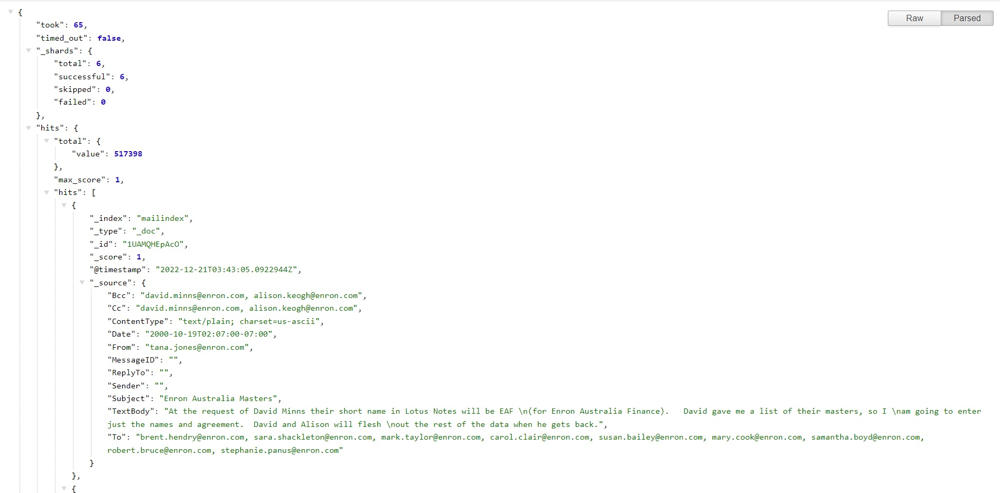
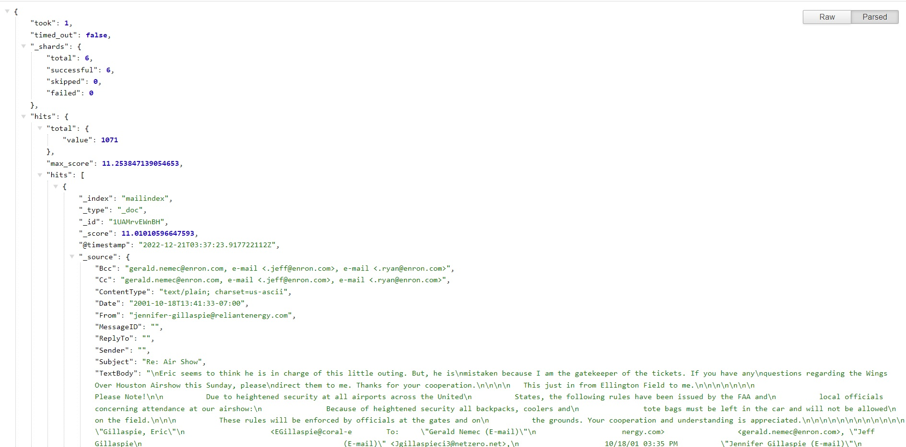
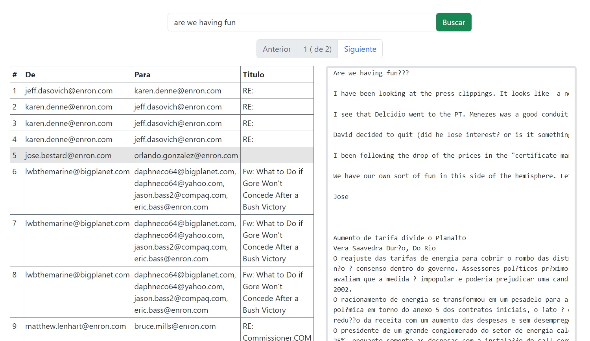

Codigo de ejemplo para:
1) Backend en Go que consume API local de zincsearch y expone api de consulta (1 metodo) utilizando CHI router
2) Frontend en Vuejs para pantalla de consulta a metodo expuesto en backend

# BACKEND

## Configuración
Previo a inicar el servicio, se necesita crear un archivo .env con las siguientes propiedades:
- ZINC_FIRST_ADMIN_USER=
- ZINC_FIRST_ADMIN_PASSWORD=
- ZINC_LOCAL_DEBUG_ENABLED=false

Donde:
- ZINC_FIRST_ADMIN_USER: es el usuario para acceder al API de ZincSearch
- ZINC_FIRST_ADMIN_PASSWORD: contraseña de usuario de API ZincSearch
- ZINC_LOCAL_DEBUG_ENABLED: boolean (true/false) habilita mensajes de consoola en modo debug

## Ejecución
Ejemplo de inicio del backend:

    cd backend
    go run proxy.go

##Ejemplos:

Para verificar la carga de datos JSON de uan busqueda general (sin criterio de busqueda):

    http://localhost:8001/ 

Para buscar registros que contienen la frase "demo", paginados para mostrar 10 resultados correspondientes a la pagina 2:

    http://localhost:8001/search?query=demo&page=2, 

# FRONTEND
Ejemplo de inicio del frontend:

    cd frontend
    npm run dev

Con esto se podrá acceder a la pantalla de consulta:

